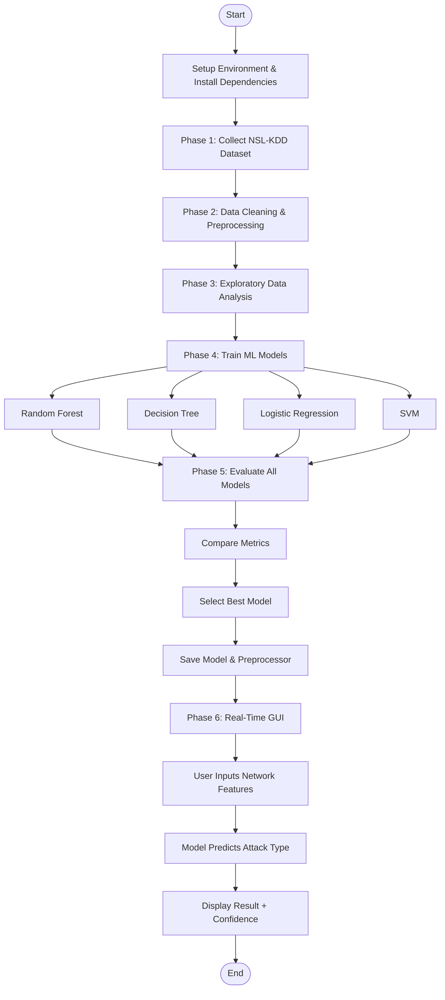
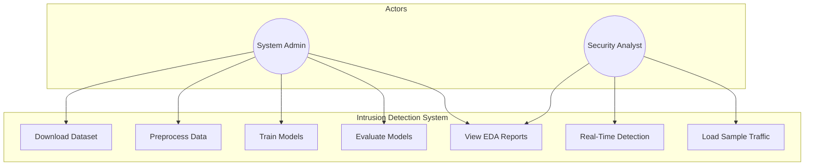
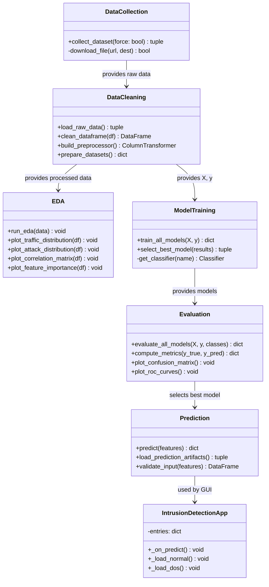
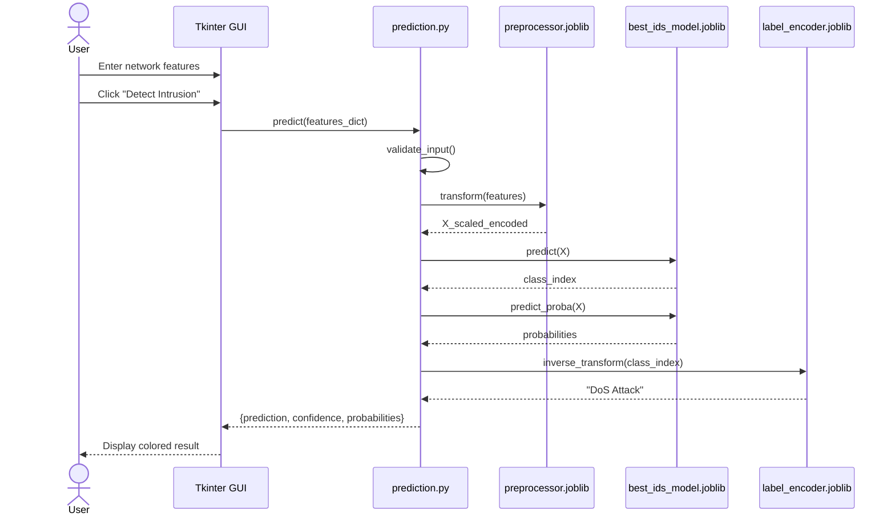
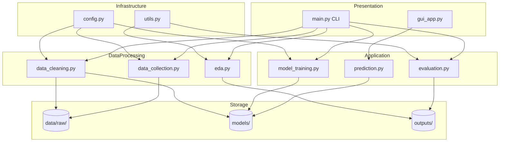

# System Architecture & Diagrams
## Machine Learning Based Intrusion Detection System

---

## 1. System Architecture

```
┌─────────────────────────────────────────────────────────────────────────────┐
│                    INTRUSION DETECTION SYSTEM (IDS)                          │
├─────────────────────────────────────────────────────────────────────────────┤
│                                                                              │
│  ┌──────────────┐    ┌──────────────┐    ┌──────────────┐    ┌────────────┐  │
│  │   DATA       │    │  PREPROCESS  │    │   ML MODEL   │    │  DETECTION │  │
│  │   LAYER      │───▶│   ENGINE     │───▶│   LAYER      │───▶│  INTERFACE │  │
│  └──────────────┘    └──────────────┘    └──────────────┘    └────────────┘  │
│         │                   │                   │                   │        │
│  NSL-KDD Dataset      Cleaning &           RF / DT / LR /      Tkinter GUI   │
│  KDDTrain+.txt        Encoding &           SVM Classifiers     CLI Predict   │
│  KDDTest+.txt         Scaling                                              │
│                                                                              │
├─────────────────────────────────────────────────────────────────────────────┤
│                         SUPPORTING COMPONENTS                                │
│  ┌─────────────┐  ┌─────────────┐  ┌─────────────┐  ┌─────────────────┐   │
│  │ Config      │  │ EDA Module  │  │ Evaluation  │  │ Model Storage   │   │
│  │ (config.py) │  │ (eda.py)    │  │ (eval.py)   │  │ (joblib .pkl)   │   │
│  └─────────────┘  └─────────────┘  └─────────────┘  └─────────────────┘   │
└─────────────────────────────────────────────────────────────────────────────┘
```

---

## 2. Data Flow Diagram

```mermaid
flowchart LR
    A[NSL-KDD Raw Data] --> B[Data Collection]
    B --> C[Data Cleaning]
    C --> D{Missing Values?}
    D -->|Yes| E[Drop / Impute]
    D -->|No| F[Duplicate Removal]
    E --> F
    F --> G[Label Mapping]
    G --> H[Feature Encoding]
    H --> I[Feature Scaling]
    I --> J[Train/Test Split]
    J --> K[Model Training]
    K --> L[Model Evaluation]
    L --> M[Best Model Selection]
    M --> N[Saved Model]
    N --> O[Real-Time Prediction]
    O --> P[Normal / DoS / Probe / R2L / U2R]
```



### Detailed Data Flow

```
INPUT: KDDTrain+.txt, KDDTest+.txt (41 features + label)
   │
   ▼
[Phase 1] Download / Load Raw CSV
   │
   ▼
[Phase 2] Clean → Encode → Scale
   │  • Remove duplicates (~77K removed from original KDD)
   │  • Map 40+ attack names → 5 categories
   │  • OneHotEncode: protocol_type, service, flag
   │  • StandardScaler: 38 numeric features
   ▼
[Phase 3] EDA → Visualizations saved to outputs/figures/
   │
   ▼
[Phase 4] Train 4 classifiers on X_train (125,973 samples)
   │
   ▼
[Phase 5] Evaluate on X_test (22,544 samples)
   │  • Accuracy, Precision, Recall, F1
   │  • Confusion Matrix, ROC-AUC
   ▼
[Phase 6] Deploy best model → GUI / API prediction
   │
   ▼
OUTPUT: Attack classification + confidence score
```

---

## 3. Workflow Diagram



---

## 4. UML Diagrams

### 4.1 Use Case Diagram



### 4.2 Class Diagram



### 4.3 Sequence Diagram — Real-Time Prediction



### 4.4 Component Diagram



---

## 5. Deployment Architecture

```
┌─────────────────────────────────────────────────┐
│              DEVELOPMENT / DEMO                  │
│  ┌─────────┐  ┌─────────┐  ┌─────────────────┐ │
│  │ Python  │  │ Joblib  │  │ Tkinter GUI     │ │
│  │ 3.9+    │  │ Models  │  │ (Local Desktop) │ │
│  └─────────┘  └─────────┘  └─────────────────┘ │
└─────────────────────────────────────────────────┘
                        │
                        ▼ (Future Production)
┌─────────────────────────────────────────────────┐
│              PRODUCTION (Future Scope)             │
│  ┌─────────┐  ┌─────────┐  ┌─────────────────┐ │
│  │ Packet  │  │ FastAPI │  │ Web Dashboard   │ │
│  │ Capture │→ │ REST API│→ │ (React/Streamlit)│ │
│  └─────────┘  └─────────┘  └─────────────────┘ │
└─────────────────────────────────────────────────┘
```

---

## 6. Security Considerations

| Layer | Consideration |
|-------|---------------|
| Data | NSL-KDD is public benchmark data; no PII |
| Model | Serialized with joblib; validate inputs before inference |
| GUI | Local-only; no network exposure |
| Production | Would require HTTPS, authentication, rate limiting |

---

*Document Version: 1.0 | Project: ML-Based IDS | Dataset: NSL-KDD*
